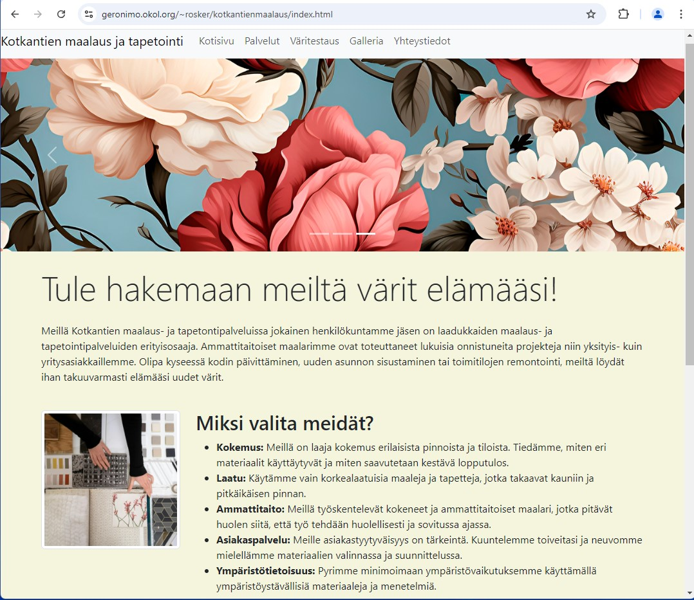
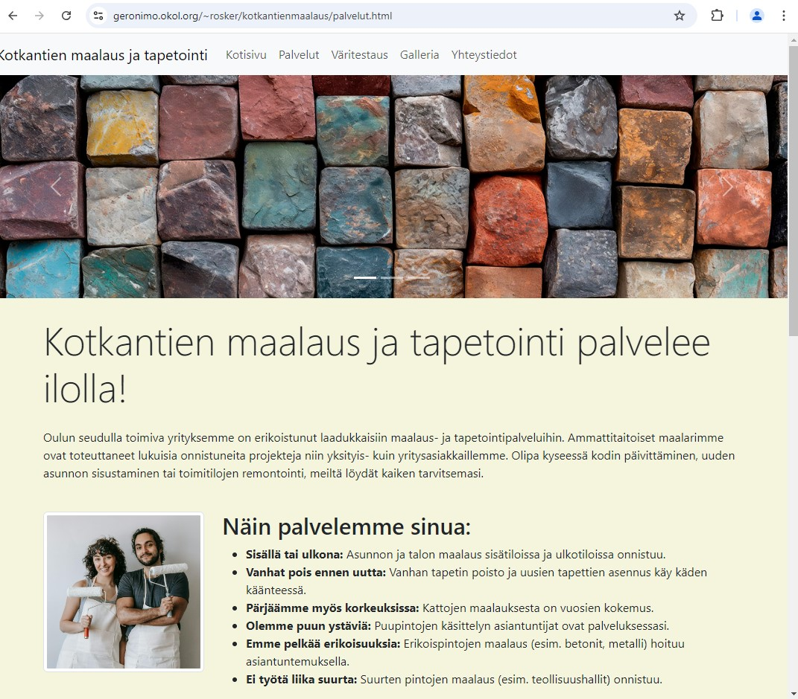
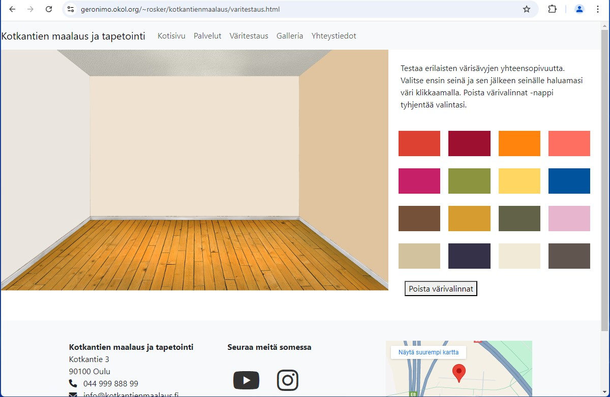
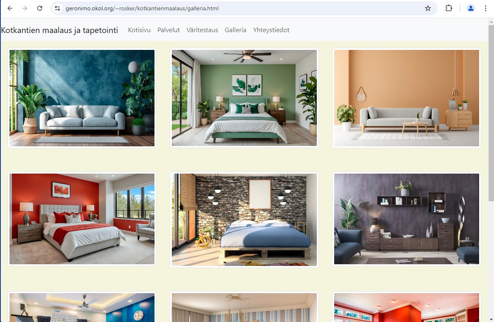
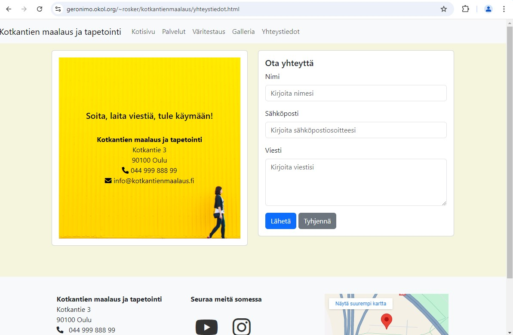

# Maalaus- ja tapetointiliikkeen verkkosivusto
Tämä projekti on verkkosivusto maalaus- ja tapetointiliikkeelle. Sivustolla esitellään yrityksen tarjoamat palvelut, kuvia valmistuneista kohteista sekä yhteystiedot. Sivustolta löytyy myös värinvalitsin, jonka avulla asiakkaat voivat kokeilla eri värisävyjen yhteensopivuutta. Sivusto on suunniteltu responsiiviseksi, joten se toimii sujuvasti niin tietokoneella kuin mobiililaitteilla. Sivuston tarkoituksena on tuoda esille yrityksen palvelut ja helpottaa asiakkaiden yhteydenottoa.

## Ominaisuudet
- Etusivu, joka esittelee yrityksen toimintaa
- Palvelut-sivu, jossa kuvataan yrityksen tarjoamat maalaus- ja tapetointipalvelut
- Galleria-sivu, jossa esitellään valmistuneita maalaus- ja tapetointikohteita
- Värinvalitsin-toiminnallisuus, jonka avulla asiakkaat voivat kokeilla värien yhteensopivuutta
- Yhteydenottolomake, jonka avulla asiakas voi ottaa yhteyttä yritykseen
- Karttaupotus, jotta asiakkaat löytävät yrityksen
- Sosiaalisen median linkit
- Responsiivinen design, joka toimii sekä tietokoneella että mobiililaitteilla

## Kuvia sivuston ulkoasusta

Sivuston kotisivu.

Yrityksen palveluita esittelevä sivu.

Väritestaus-sivu. Asiakkaat voivat kokeilla erilaisten värisävyjen yhteensopivuutta klikkaamalla kuvassa olevia seinäpintoja ja sen jälkeen haluamaansa väriä. Seinille pystyy valitsemaan yhteensä kolme eri väriä, tai vaikka saman sävy kaikille kolmelle seinälle.

Galleria-sivusto esittelee yrityksen valmistuneita maalaus- ja tapetointikohteita.

Yhteystiedot-sivulla olevalla lomakkeella asiakkaat voivat ottaa yhteyttä yritykseen.

## Tulevaisuuden kehitysajatuksia
- Lisää yhteydenottolomakkeen palvelinpuolen käsittely
- Lisää tuotteiden esittelysivu, jossa käyttäjät voivat selata maaleja ja tapetteja
 
